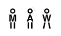
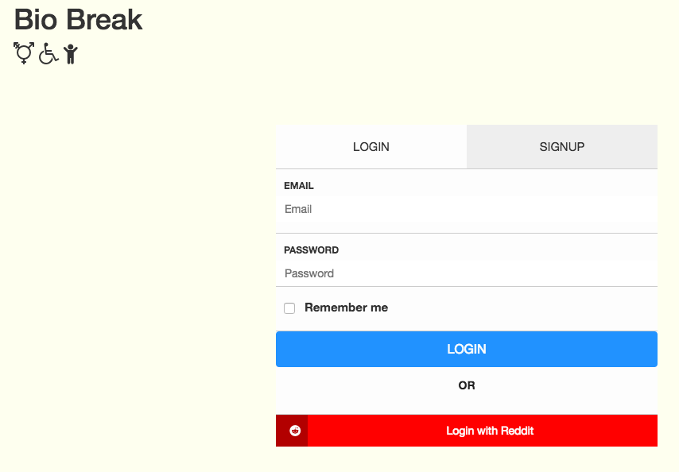

# Bio Break

  &nbsp;
  &nbsp;
  

This is a student project I made while attending Hackbright Academy in San Francisco. Web app to find public bathrooms: gender neutral, disability accessible and child changing table.

## Tech Stack
1. Python 2.7/Flask
1. Postgresql database
1. APIs: Google Maps/Places and Reddit OAuth2

### Want to use this project?

## Basics

1. Fork/Clone
1. Activate a virtualenv or use Amazon's Cloud 9
1. Install the requirements
1. You will need to get your own Reddit and Google API keys

No warranties or expressed or implied.

## Screen Shots

   
  

